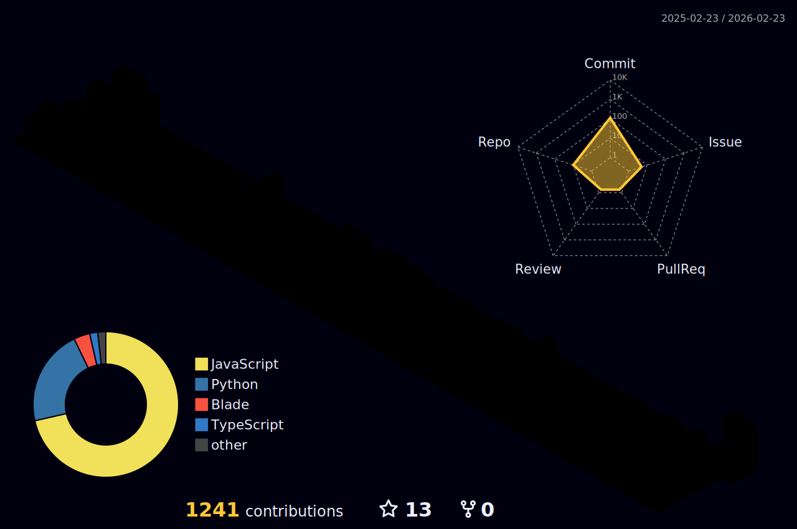

  

  

    
    
  

  

---

# 👨‍💻 About Me

- 💻 **Frontend:** HTML, CSS, Tailwind, JavaScript, React, React Native
- ⚙ **Backend:** PHP, Laravel, Node.js, Express.js, C#
- 🗄 **Databases:** MySQL, MongoDB
- 🧠 **Exploring:** AWS Development
- 🎯 **Goal:** Become a high-level full stack developer
- 🎨 **Hobby:** Photography

---

# 🧩 Tech Stack

  

---

# 📊 GitHub Analytics

  
    

<table border="0px">
  <tr>
    <td>
      
    </td>
    <td>
      
    </td>
  </tr>
</table>

  

---

# 🏆 Activity Graph & Contributions

  
    

  <picture>
    <source media="(prefers-color-scheme: dark)" srcset="https://raw.githubusercontent.com/ark-creator/ark-creator/output/github-contribution-grid-snake-dark.svg">
    <source media="(prefers-color-scheme: light)" srcset="https://raw.githubusercontent.com/ark-creator/ark-creator/output/github-contribution-grid-snake.svg">
    
  </picture>

  

---

# 🚧 Current Projects

### 🛒 Electronik Hub Ecommerce System
> A full-scale e-commerce platform built for high performance and security.
- **Key Features:** Secure Two-Factor Authentication (2FA), seamless OAuth integration, dynamic product management, and an automated review moderation system.
- **Tech:** Laravel, React, MySQL

### 📊 Electronik Hub Project Management System
> An internal tool designed to streamline workflows, track tasks, and manage resources effectively across development stages.

### 🌾 ALOG Agri Supply
> An agricultural supply management system designed for efficient inventory and distribution.
- **Tech:** PHP, JavaScript, Tailwind CSS

---

# 👨‍💻 Visit my Web Portfolio

